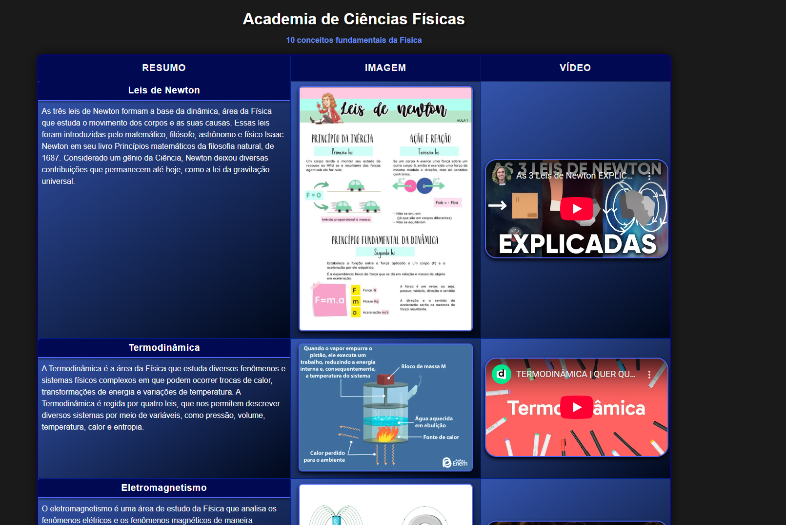
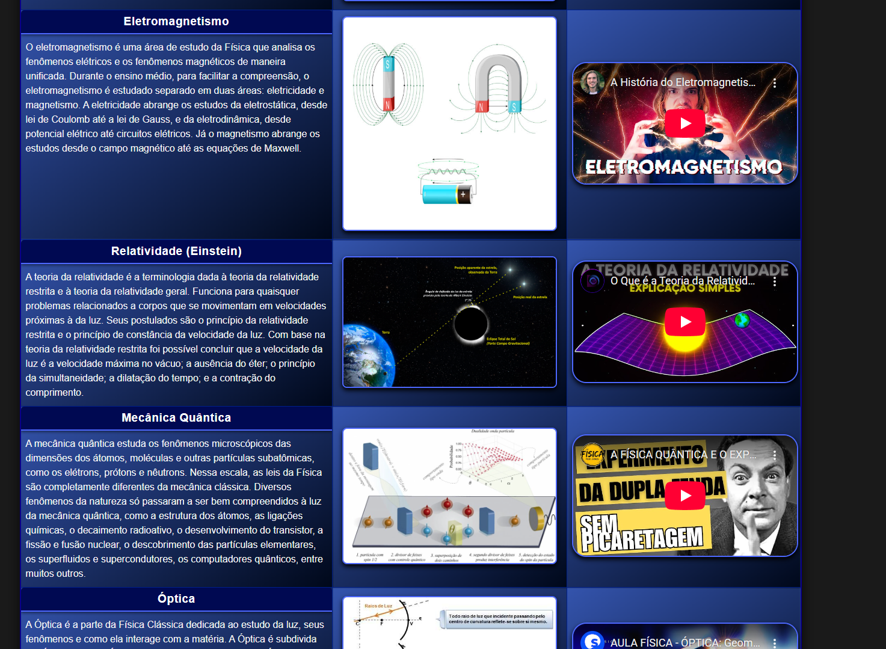
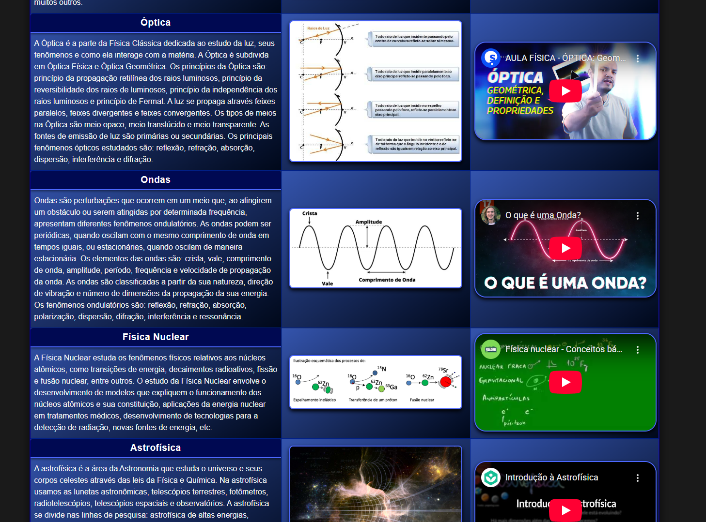
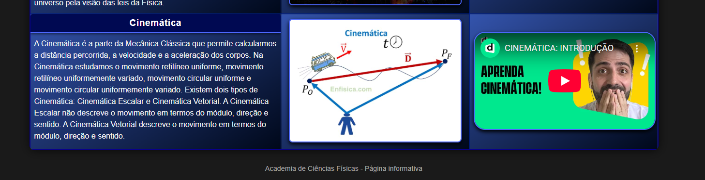

# Academia de Ciências Físicas 


Uma página web informativa desenvolvida para apresentar os 10 conceitos fundamentais da Física de forma clara, visual e interativa. Projeto acadêmico para a disciplina de Desenvolvimento Web.

## Screenshots

### Tela Principal (Part.1)


### Tela Principal (Part.2)


### Tela Principal (Part.3)


### Tela Principal (Part.4)


## Sobre o Projeto

Este site foi criado com o objetivo de reunir os principais tópicos da Física em um só lugar, facilitando o acesso a informações, imagens ilustrativas e vídeos explicativos. Cada conceito é apresentado em uma linha da tabela, contendo:

- **Resumo**: Explicação concisa sobre o conceito, com destaque para o título do assunto
- **Imagem**: Representação visual relacionada ao tema
- **Vídeo**: Vídeo do YouTube incorporado para aprofundamento

## Tecnologias Utilizadas

- **HTML5** - Estruturação do conteúdo
- **CSS3** - Estilização e responsividade
  - Flexbox para alinhamento
  - Gradientes para efeitos visuais
 

## Conceitos Abordados

1. Leis de Newton
2. Termodinâmica
3. Eletromagnetismo
4. Relatividade (Einstein)
5. Mecânica Quântica
6. Óptica
7. Ondas
8. Física Nuclear
9. Astrofísica
10. Cinemática

## Design

O projeto utiliza uma paleta de cores escura com tons de azul em gradiente:

- Fundo escuro (#1a1a1a)
- Gradientes em azul para as células da tabela
- Destaques em azul claro para bordas
- Efeito hover nas linhas para melhor interatividade


## 🛠️ Como Executar

1. Clone o repositório:
   ```bash
   [git clone https://github.com/seu-usuario/academia-ciencias-fisicas.git](https://github.com/FaculdadeJV/Academia-de-Ciencias-Fisicas_Web.git)

   
## Autor
- Jonathan Arsego Lêla
- RA: 22408629
- Engenharia da Computação - CEUB
   
